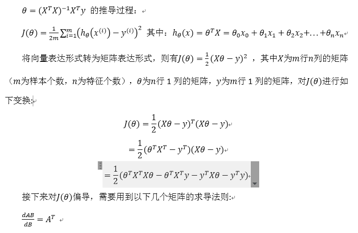

吴恩达机器学习视频

# 1、引言
## 1、机器学习是什么？
由Tom Mitchell提出，来自卡内基梅隆大学，Tom定义的机器学习是，一个好的学习问题定义如下，
他说，一个程序被认为能从经验E中学习，解决任务T，达到性能度量值P，当且仅当，有了经验E后，经过P评判，
程序在处理T时的性能有所提升。

回归这个词的意思是，我们在试着推测出这一系列连续值属性。

## 2、监督学习
其基本思想是，我们数据集中的每个样本都有相应的“正确答案”。再根据这些样本作出预测。

[垃圾邮件问题]。如果你有标记好的数据，区别好是垃圾还是非垃圾邮件，我们把这个当作监督学习问题。

## 3、无监督学习
聚类算法

自动地找到数据中的结构
[新闻事件分类] 
新闻事件分类的例子，就是那个谷歌新闻的例子，我们在本视频中有见到了，
我们看到，可以用一个聚类算法来聚类这些文章到一起，所以是无监督学习。

# 2、单变量线性回归(Linear Regression with One Variable)

预测住房价格的

这就是一个监督学习算法的工作方式，我们可以看到这里有我们的训练集里房屋价格 我们把它喂给我们的学习算法，学习算法的工作了，
然后输出一个函数，通常表示为小写 h 表示。h 代表hypothesis(假设)，h表示一个函数，输入是房屋尺寸大小，就像你朋友想出售的房屋，
因此 h 根据输入的 x值来得出 y 值，y 值对应房子的价格 因此，h 是一个从x 到 y 的函数映射。

我将选择最初的使用规则h代表hypothesis，因而，要解决房价预测问题，我们实际上是要将训练集“喂”给我们的学习算法，进而学习得到一个假设h，
然后将我们要预测的房屋的尺寸作为输入变量输入给h，预测出该房屋的交易价格作为输出变量输出为结果。那么，对于我们的房价预测问题，我们该如何表达 h？
一种可能的表达方式为：h_θ (x)=θ_0+θ_1 x，因为只含有一个特征/输入变量，因此这样的问题叫作单变量线性回归问题。

# 2.1、代价函数

在线性回归中我们有一个像这样的训练集，m代表了训练样本的数量，比如 m=47。而我们的假设函数，
也就是用来进行预测的函数，是这样的线性函数形式：h_θ (x)=θ_0+θ_1 x。
接下来我们会引入一些术语我们现在要做的便是为我们的模型选择合适的参数（parameters）θ_0 和 θ_1，
在房价问题这个例子中便是直线的斜率和在y 轴上的截距。
我们选择的参数决定了我们得到的直线相对于我们的训练集的准确程度，
模型所预测的值与训练集中实际值之间的差距（下图中蓝线所指）就是[建模误差]（modeling error）。

代价函数也被称作平方误差函数，有时也被称为平方误差代价函数。我们之所以要求出误差的平方和，
是因为误差平方代价函数，对于大多数问题，特别是回归问题，都是一个合理的选择。还有其他的代价函数也能很好地发挥作用，
但是平方误差代价函数可能是解决回归问题最常用的手段了。

代价函数的直观理解

## 2.2、梯度下降
梯度下降是一个用来求函数最小值的算法，我们将使用梯度下降算法来求出代价函数J(θ_0,θ_1) 的最小值。

批量梯度下降  学习率

在梯度下降算法中，还有一个更微妙的问题，梯度下降中，我们要更新θ_0和θ_1

梯度下降的直观描述

对于这个问题，求导的目的，基本上可以说取这个红点的切线，就是这样一条红色的直线，刚好与函数相切于这一点，
让我们看看这条红色直线的斜率，就是这条刚好与函数曲线相切的这条直线，
这条直线的斜率正好是这个三角形的高度除以这个水平长度，现在，这条线有一个正斜率，也就是说它有正导数，
因此，我得到的新的θ_1，θ_1更新后等于θ_1减去一个正数乘以a。

让我们来看看如果a太小或a太大会出现什么情况：
如果a太小了，即我的学习速率太小，结果就是只能这样像小宝宝一样一点点地挪动，去努力接近最低点，这样就需要很多步才能到达最低点，所以如果a太小的话，可能会很慢，因为它会一点点挪动，它会需要很多步才能到达全局最低点。
如果a太大，那么梯度下降法可能会越过最低点，甚至可能无法收敛，下一次迭代又移动了一大步，越过一次，又越过一次，一次次越过最低点，直到你发现实际上离最低点越来越远，所以，如果a太大，它会导致无法收敛，甚至发散。
现在，我还有一个问题，当我第一次学习这个地方时，我花了很长一段时间才理解这个问题，如果我们预先把θ_1放在一个局部的最低点，你认为下一步梯度下降法会怎样工作？

假设你将θ_1初始化在局部最低点，在这儿，它已经在一个局部的最优处或局部最低点。结果是局部最优点的导数将等于零，因为它是那条切线的斜率。这意味着你已经在局部最优点，它使得θ_1不再改变，也就是新的θ_1等于原来的θ_1，因此，如果你的参数已经处于局部最低点，那么梯度下降法更新其实什么都没做，它不会改变参数的值。这也解释了为什么即使学习速率a保持不变时，梯度下降也可以收敛到局部最低点

我想找到它的最小值，首先初始化我的梯度下降算法，在那个品红色的点初始化，如果我更新一步梯度下降，也许它会带我到这个点，因为这个点的导数是相当陡的。现在，在这个绿色的点，如果我再更新一步，你会发现我的导数，也即斜率，是没那么陡的。随着我接近最低点，我的导数越来越接近零，所以，梯度下降一步后，新的导数会变小一点点。然后我想再梯度下降一步，在这个绿点，我自然会用一个稍微跟刚才在那个品红点时比，再小一点的一步，到了新的红色点，更接近全局最低点了，因此这点的导数会比在绿点时更小。所以，我再进行一步梯度下降时，我的导数项是更小的，θ_1更新的幅度就会更小。所以随着梯度下降法的运行，你移动的幅度会自动变得越来越小，直到最终移动幅度非常小，你会发现，已经收敛到局部极小值。
回顾一下，在梯度下降法中，当我们接近局部最低点时，梯度下降法会自动采取更小的幅度，这是因为当我们接近局部最低点时，很显然在局部最低时导数等于零，所以当我们接近局部最低时，导数值会自动变得越来越小，所以梯度下降将自动采取较小的幅度，这就是梯度下降的做法。所以实际上没有必要再另外减小a。

这就是梯度下降算法，你可以用它来最小化任何代价函数J，不只是线性回归中的代价函数J。

## 2.3、梯度下降的线性回归
在线性回归问题中使用梯度下降求解参数

有几个求解参数，变换成几个方程等式

# 3、线性代数回顾(Linear Algebra Review)

## 3.1、矩阵和向量

## 3.2 加法和标量乘法

## 3.3 矩阵向量乘法

## 3.4 矩阵乘法

## 3.5 矩阵乘法的性质

## 3.6 逆和转置

# 4、多变量线性回归(Linear Regression with Multiple Variables)
4.1、多维特征

4.2、多变量梯度下降

4.3、梯度下降法实践1-特征缩放

4.4、梯度下降法实践2-学习率

4.5、特征和多项式回归

4.6、正规方程

总结一下，只要特征变量的数目并不大，标准方程是一个很好的计算参数θ的替代方法。具体地说，只要特征变量数量小于一万，我通常使用标准方程法，而不使用梯度下降法。
随着我们要讲的学习算法越来越复杂，例如，当我们讲到分类算法，像逻辑回归算法，我们会看到，实际上对于那些算法，并不能使用标准方程法。对于那些更复杂的学习算法，我们将不得不仍然使用梯度下降法。因此，梯度下降法是一个非常有用的算法，可以用在有大量特征变量的线性回归问题。或者我们以后在课程中，会讲到的一些其他的算法，因为标准方程法不适合或者不能用在它们上。但对于这个特定的线性回归模型，标准方程法是一个比梯度下降法更快的替代算法。所以，根据具体的问题，以及你的特征变量的数量，这两种算法都是值得学习的。

4.7、θ=(X^T X)^(-1) X^T y 的推导过程

# 6、逻辑回归(Logistic Regression)

## 6.1、分类问题

在分类问题中，你要预测的变量 y 是离散的值，我们将学习一种叫做逻辑回归 (Logistic Regression) 的算法，这是目前最流行使用最广泛的一种学习算法。
在分类问题中，我们尝试预测的是结果是否属于某一个类（例如正确或错误）。
分类问题的例子有：
判断一封电子邮件是否是垃圾邮件；
判断一次金融交易是否是欺诈；
之前我们也谈到了肿瘤分类问题的例子，区别一个肿瘤是恶性的还是良性的。

顺便说一下，逻辑回归算法是分类算法，我们将它作为分类算法使用。有时候可能因为这个算法的名字中出现了“回归”使你感到困惑，
但[逻辑回归算法实际上是一种分类算法]，它适用于标签 y 取值离散的情况，如：1 0 0 1

## 6.2、假说表示

我们引入一个新的模型，逻辑回归，该模型的输出变量范围始终在0和1之间。 逻辑回归模型的假设是： h_θ (x)=g(θ^T X) 
其中： X 代表特征向量 g 代表逻辑函数（logistic function)是一个常用的逻辑函数为S形函数（Sigmoid function），公式为： g(z)=1/(1+e^(-z) )。

## 6.3、判定边界
现在讲下决策边界(decision boundary)的概念。这个概念能更好地帮助我们理解逻辑回归的假设函数在计算什么。

## 6.4、代价函数
我们要介绍如何拟合逻辑回归模型的参数θ。具体来说，我要定义用来拟合参数的优化目标或者叫代价函数，
这便是监督学习问题中的逻辑回归模型的拟合问题

在这个视频中，我们定义了单训练样本的代价函数，凸性分析的内容是超出这门课的范围的，但是可以证明我们所选的代价值函数会给我们一个凸优化问题。代价函数J(θ)会是一个凸函数，并且没有局部最优值。
推导过程：

注：虽然得到的梯度下降算法表面上看上去与线性回归的梯度下降算法一样，但是这里的h_θ (x)=g(θ^T X)与线性回归中不同，所以实际上是不一样的。另外，在运行梯度下降算法之前，进行特征缩放依旧是非常必要的。
一些梯度下降算法之外的选择： 除了梯度下降算法以外，还有一些常被用来令代价函数最小的算法，这些算法更加复杂和优越，而且通常不需要人工选择学习率，通常比梯度下降算法要更加快速。这些算法有：共轭梯度（Conjugate Gradient），局部优化法(Broyden fletcher goldfarb shann,BFGS)和有限内存局部优化法(LBFGS) 

## 6.5、简化的成本函数和梯度下降

## 6.6、高级优化

## 6.7、多类别分类：一对多（多分类问题）
可以把多分类问题转化为二分类问题

# 7、正则化(Regularization)（解决过拟合问题）

## 7.1、过拟合的问题

## 7.2、代价函数

## 7.3、正则化线性回归

## 7.4、正则化的逻辑回归模型

# 8、神经网络：表述(Neural Networks: Representation)
非线性假设

神经元和大脑

模型表示1

模型表示2

特征和直观理解

多类分类

# 9、神经网络的学习(Neural Networks: Learning)
代价函数

反向传播算法

反向传播算法的直观理解

实现注意：展开参数

梯度检验

随机初始化

## 9.7、综合起来
小结一下使用神经网络时的步骤：
网络结构：第一件要做的事是选择网络结构，即决定选择多少层以及决定每层分别有多少个单元。
第一层的单元数即我们训练集的特征数量。
最后一层的单元数是我们训练集的结果的类的数量。
如果隐藏层数大于1，确保每个隐藏层的单元个数相同，通常情况下隐藏层单元的个数越多越好。
我们真正要决定的是隐藏层的层数和每个中间层的单元数。
训练神经网络：
	参数的随机初始化
	利用正向传播方法计算所有的h_θ (x)
	编写计算代价函数 J 的代码
	利用反向传播方法计算所有偏导数
	利用数值检验方法检验这些偏导数
	使用优化算法来最小化代价函数

## 9.8、自主驾驶

使用神经网络来实现自动驾驶，也就是说使汽车通过学习来自己驾驶

# 10、应用机器学习的建议(Advice for Applying Machine Learning)

## 10.1、决定下一步做什么

当我们运用训练好了的模型来预测未知数据的时候发现有较大的误差，我们下一步可以做什么？
获得更多的训练实例――通常是有效的，但代价较大，下面的方法也可能有效，可考虑先采用下面的几种方法。
1.尝试减少特征的数量
2.尝试获得更多的特征
3.尝试增加多项式特征
4.尝试减少正则化程度λ
5.尝试增加正则化程度λ
我们不应该随机选择上面的某种方法来改进我们的算法，而是运用一些机器学习诊断法来帮助我们知道上面哪些方法对我们的算法是有效的。

## 10.2、评估一个假设
评估过拟合和欠拟合问题，简单的通过画图观察，复杂的可以通过数据集的交叉验证

## 10.3、模型选择和交叉验证集（把数据集分成训练集、交叉验证集、测试集）

## 10.4、诊断偏差和方差
当你运行一个学习算法时，如果这个算法的表现不理想，那么多半是出现两种情况：要么是偏差比较大，要么是方差比较大。
换句话说，出现的情况要么是欠拟合，要么是过拟合问题。那么这两种情况，哪个和偏差有关，哪个和方差有关，或者是不是和两个都有关？
搞清楚这一点非常重要，因为能判断出现的情况是这两种情况中的哪一种。其实是一个很有效的指示器，指引着可以改进算法的最有效的方法和途径。
在这段视频中，我想更深入地探讨一下有关偏差和方差的问题，希望你能对它们有一个更深入的理解，并且也能弄清楚怎样评价一个学习算法，
能够判断一个算法是偏差还是方差有问题，因为这个问题对于弄清如何改进学习算法的效果非常重要，
高偏差和高方差的问题基本上来说是欠拟合和过拟合的问题。

## 10.5、正则化和偏差/方差

## 10.6、学习曲线

## 10.7、下一步做什么

1. 获得更多的训练实例――解决高方差
2. 尝试减少特征的数量――解决高方差
3. 尝试获得更多的特征――解决高偏差
4. 尝试增加多项式特征――解决高偏差
5. 尝试减少正则化程度λ――解决高偏差
6. 尝试增加正则化程度λ――解决高方差
神经网络的方差和偏差： 
 使用较小的神经网络，类似于参数较少的情况，容易导致高偏差和欠拟合，但计算代价较小使用较大的神经网络，类似于参数较多的情况，
 容易导致高方差和过拟合，虽然计算代价比较大，但是可以通过正则化手段来调整而更加适应数据。
 
  通常选择较大的神经网络并采用正则化处理会比采用较小的神经网络效果要好。
  对于神经网络中的隐藏层的层数的选择，通常从一层开始逐渐增加层数，为了更好地作选择，可以把数据分为训练集、交叉验证集和测试集，针对不同隐藏层层数的神经网络训练神经网络， 然后选择交叉验证集代价最小的神经网络。

# 11、机器学习系统的设计(Machine Learning System Design)

## 11.1、首先要做什么

## 11.2、误差分析

构建一个学习算法的推荐方法为：
1. 从一个简单的能快速实现的算法开始，实现该算法并用交叉验证集数据测试这个算法
2. 绘制学习曲线，决定是增加更多数据，或者添加更多特征，还是其他选择
3. 进行误差分析：人工检查交叉验证集中我们算法中产生预测误差的实例，看看这些实例是否有某种系统化的趋势

## 11.3、类偏斜的误差度量
类偏斜情况表现为我们的训练集中有非常多的同一种类的实例，只有很少或没有其他类的实例。[数据倾斜问题]

 查准率（Precision）和查全率（Recall） 我们将算法预测的结果分成四种情况：
 1. 正确肯定（True Positive,TP）：预测为真，实际为真
 2. 正确否定（True Negative,TN）：预测为假，实际为假
 3. 错误肯定（False Positive,FP）：预测为真，实际为假
 4. 错误否定（False Negative,FN）：预测为假，实际为真
 则：查准率=TP/(TP+FP)。例，在所有我们预测有恶性肿瘤的病人中，实际上有恶性肿瘤的病人的百分比，越高越好。
 查全率=TP/(TP+FN)。例，在所有实际上有恶性肿瘤的病人中，成功预测有恶性肿瘤的病人的百分比，越高越好。

## 11.4、查准率和查全率之间的权衡

## 11.5、机器学习的数据

# 12、支持向量机(Support Vector Machines)

## 12.1、优化目标

## 12.2、大边界的直观理解

人们有时将支持向量机看作是大间距分类器

## 12.3、核函数

## 12.4、使用支持向量机

# 13、聚类(Clustering)

## 13.1、无监督学习：简介

## 13.2、K-均值算法

K-均值是最普及的聚类算法，算法接受一个未标记的数据集，然后将数据聚类成不同的组。
K-均值是一个迭代算法，假设我们想要将数据聚类成n个组，其方法为:
首先选择K个随机的点，称为聚类中心（cluster centroids）；
对于数据集中的每一个数据，按照距离K个中心点的距离，将其与距离最近的中心点关联起来，与同一个中心点关联的所有点聚成一类。
计算每一个组的平均值，将该组所关联的中心点移动到平均值的位置。
重复步骤2-4直至中心点不再变化。

## 13.3、优化目标

## 13.4、随机初始化

## 13.5、选择聚类数

# 14、降维(Dimensionality Reduction)

动机一：数据压缩

动机二：数据可视化

主成分分析问题

主成分分析算法

选择主成分的数量

重建的压缩表示

主成分分析法的应用建议

# 15、异常检测(Anomaly Detection)
问题的动机

高斯分布

算法

开发和评价一个异常检测系统

异常检测与监督学习对比

选择特征

多元高斯分布（选修）

使用多元高斯分布进行异常检测（选修）

# 16、推荐系统(Recommender Systems)
问题形式化

基于内容的推荐系统

协同过滤

协同过滤算法

向量化：低秩矩阵分解

推行工作上的细节：均值归一化

# 17、大规模机器学习(Large Scale Machine Learning)

大型数据集的学习

随机梯度下降法

小批量梯度下降

随机梯度下降收敛

在线学习

映射化简和数据并行

# 18、应用实例：图片文字识别(Application Example: Photo OCR)

问题描述和流程图

滑动窗口

获取大量数据和人工数据

上限分析：哪部分管道的接下去做

# 附件
## 1、高等数学

## 2、线性代数

### 2.1、行列式

### 2.2、矩阵

### 2.3、向量

### 2.4、线性方程组

### 2.5、矩阵的特征值和特征向量

### 2.6、二次型

## 3、概率论和数理统计
### 3.1、随机事件和概率

### 3.2、随机变量及其概率分布

### 3.3、多维随机变量及其分布

### 3.4、随机变量的数字特征

### 3.5、数理统计的基本概念

