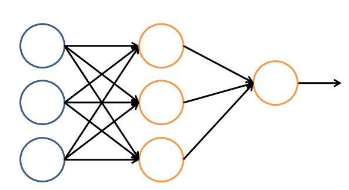

# 1、概述
机器学习的核心是：即统计和归纳

机器学习根据所处理数据种类的不同，可以分为有监督学习，无监督学习，半监督学习和强化学习等几种类型。

机器学习方法是计算机利用已有的数据(经验)，得出了某种模型(迟到的规律)，并利用此模型预测未来(是否迟到)的一种方法。
从实践的意义上来说，机器学习是一种通过利用数据，训练出模型，然后使用模型预测的一种方法。

# 2、机器学习的方法

## 1、回归算法(线性回归，逻辑回归)

在大部分机器学习课程中，回归算法都是介绍的第一个算法。原因有两个：一.回归算法比较简单，介绍它可以让人平滑地从统计学迁移到机器学习中。
二.回归算法是后面若干强大算法的基石，如果不理解回归算法，无法学习那些强大的算法。回归算法有两个重要的子类：即线性回归和逻辑回归。

线性回归就是我们前面说过的房价求解问题。如何拟合出一条直线最佳匹配我所有的数据？一般使用“[最小二乘法]”来求解。“最小二乘法”的思想是这样的，
假设我们拟合出的直线代表数据的真实值，而观测到的数据代表拥有误差的值。为了尽可能减小误差的影响，需要求解一条直线使所有误差的平方和最小。
最小二乘法将最优问题转化为求函数极值问题。函数极值在数学上我们一般会采用求导数为0的方法。但这种做法并不适合计算机，可能求解不出来，也可能计算量太大。

计算机科学界专门有一个学科叫“数值计算”，专门用来提升计算机进行各类计算时的准确性和效率问题。例如，著名的“[梯度下降]”
以及“牛顿法”就是数值计算中的经典算法，
也非常适合来处理求解函数极值的问题。梯度下降法是解决回归模型中最简单且有效的方法之一。从严格意义上来说，由于后文中的神经网络和推荐算法中都有线性回归的因子，
因此梯度下降法在后面的算法实现中也有应用。

逻辑回归是一种与线性回归非常类似的算法，但是，从本质上讲，线型回归处理的问题类型与逻辑回归不一致。线性回归处理的是数值问题，也就是最后预测出的结果是数字，例如房价。
而逻辑回归属于分类算法，也就是说，逻辑回归预测结果是离散的分类，例如判断这封邮件是否是垃圾邮件，以及用户是否会点击此广告等等。

实现方面的话，逻辑回归只是对对线性回归的计算结果加上了一个Sigmoid函数，将数值结果转化为了0到1之间的概率(Sigmoid函数的图像一般来说并不直观，你只需要理解对数值越大
，函数越逼近1，数值越小，函数越逼近0)，接着我们根据这个概率可以做预测，例如概率大于0.5，则这封邮件就是垃圾邮件，或者肿瘤是否是恶性的等等。
从直观上来说，逻辑回归是画出了一条分类线，

假设我们有一组肿瘤患者的数据，这些患者的肿瘤中有些是良性的(图中的蓝色点)，有些是恶性的(图中的红色点)。这里肿瘤的红蓝色可以被称作数据的“标签”。
同时每个数据包括两个“特征”：患者的年龄与肿瘤的大小。我们将这两个特征与标签映射到这个二维空间上，形成了我上图的数据。

当我有一个绿色的点时，我该判断这个肿瘤是恶性的还是良性的呢？根据红蓝点我们训练出了一个逻辑回归模型，也就是图中的分类线。
这时，根据绿点出现在分类线的左侧，因此我们判断它的标签应该是红色，也就是说属于恶性肿瘤。

　　逻辑回归算法划出的分类线基本都是线性的(也有划出非线性分类线的逻辑回归，不过那样的模型在处理数据量较大的时候效率会很低)，这意味着当两类之间的界线不是线性时，逻辑回归的表达能力就不足。下面的两个算法是机器学习界最强大且重要的算法，都可以拟合出非线性的分类线

## 2、神经网络
让我们看一个简单的神经网络的逻辑架构。在这个网络中，分成输入层，隐藏层，和输出层。
输入层负责接收信号，隐藏层负责对数据的分解与处理，最后的结果被整合到输出层。每层中的一个圆代表一个处理单元，可以认为是模拟了一个神经元，
若干个处理单元组成了一个层，若干个层再组成了一个网络，也就是"神经网络"。

在神经网络中，每个处理单元事实上就是一个逻辑回归模型，逻辑回归模型接收上层的输入，把模型的预测结果作为输出传输到下一个层次。
通过这样的过程，神经网络可以完成非常复杂的非线性分类。

## 3、SVM（支持向量机）
支持向量机算法是诞生于统计学习界，同时在机器学习界大放光彩的经典算法。
支持向量机算法从某种意义上来说是逻辑回归算法的强化：通过给予逻辑回归算法更严格的优化条件，支持向量机算法可以获得比逻辑回归更好的分类界线。
但是如果没有某类函数技术，则支持向量机算法最多算是一种更好的线性分类技术。

但是，通过跟高斯“核”的结合，支持向量机可以表达出非常复杂的分类界线，从而达成很好的的分类效果。
“核”事实上就是一种特殊的函数，最典型的特征就是可以将低维的空间映射到高维的空间。

我们如何在二维平面划分出一个圆形的分类界线？在二维平面可能会很困难，但是通过“核”可以将二维空间映射到三维空间，
然后使用一个线性平面就可以达成类似效果。也就是说，二维平面划分出的非线性分类界线可以等价于三维平面的线性分类界线。
于是，我们可以通过在三维空间中进行简单的线性划分就可以达到在二维平面中的非线性划分效果。

支持向量机是一种数学成分很浓的机器学习算法（相对的，神经网络则有生物科学成分）。
在算法的核心步骤中，有一步证明，即将数据从低维映射到高维不会带来最后计算复杂性的提升。于是，通过支持向量机算法，既可以保持计算效率，
又可以获得非常好的分类效果。因此支持向量机在90年代后期一直占据着机器学习中最核心的地位，基本取代了神经网络算法。
直到现在神经网络借着深度学习重新兴起，两者之间才又发生了微妙的平衡转变。

## 4、聚类算法
前面的算法中的一个显著特征就是我的训练数据中包含了标签，训练出的模型可以对其他未知数据预测标签。在下面的算法中，训练数据都是不含标签的，
而算法的目的则是通过训练，推测出这些数据的标签。这类算法有一个统称，即无监督算法(前面有标签的数据的算法则是有监督算法)。
无监督算法中最典型的代表就是聚类算法。

让我们还是拿一个二维的数据来说，某一个数据包含两个特征。我希望通过聚类算法，给他们中不同的种类打上标签，我该怎么做呢？
简单来说，聚类算法就是计算种群中的距离，根据距离的远近将数据划分为多个族群。

聚类算法中最典型的代表就是K-Means算法。

## 5、降维算法
降维算法也是一种无监督学习算法，其主要特征是将数据从高维降低到低维层次。在这里，维度其实表示的是数据的特征量的大小，
例如，房价包含房子的长、宽、面积与房间数量四个特征，也就是维度为4维的数据。可以看出来，长与宽事实上与面积表示的信息重叠了，
例如面积=长 × 宽。通过降维算法我们就可以去除冗余信息，将特征减少为面积与房间数量两个特征，即从4维的数据压缩到2维。
于是我们将数据从高维降低到低维，不仅利于表示，同时在计算上也能带来加速。

刚才说的降维过程中减少的维度属于肉眼可视的层次，同时压缩也不会带来信息的损失(因为信息冗余了)。如果肉眼不可视，或者没有冗余的特征，
降维算法也能工作，不过这样会带来一些信息的损失。但是，降维算法可以从数学上证明，从高维压缩到的低维中最大程度地保留了数据的信息。
因此，使用降维算法仍然有很多的好处。

降维算法的主要作用是压缩数据与提升机器学习其他算法的效率。通过降维算法，可以将具有几千个特征的数据压缩至若干个特征。
另外，降维算法的另一个好处是数据的可视化，例如将5维的数据压缩至2维，然后可以用二维平面来可视。降维算法的主要代表是PCA算法(即主成分分析算法)。

## 6、推荐算法
推荐算法是目前业界非常火的一种算法，在电商界，如亚马逊，天猫，京东等得到了广泛的运用。推荐算法的主要特征就是可以自动向用户推荐他们最感兴趣的东西，
从而增加购买率，提升效益。推荐算法有两个主要的类别：

一类是基于物品内容的推荐，是将与用户购买的内容近似的物品推荐给用户，这样的前提是每个物品都得有若干个标签，
因此才可以找出与用户购买物品类似的物品，这样推荐的好处是关联程度较大，但是由于每个物品都需要贴标签，因此工作量较大。

另一类是基于用户相似度的推荐，则是将与目标用户兴趣相同的其他用户购买的东西推荐给目标用户，
例如小A历史上买了物品B和C，经过算法分析，发现另一个与小A近似的用户小D购买了物品E，于是将物品E推荐给小A。

两类推荐都有各自的优缺点，在一般的电商应用中，一般是两类混合使用。推荐算法中最有名的算法就是协同过滤算法。

## 7、其他
除了以上算法之外，机器学习界还有其他的如高斯判别，朴素贝叶斯，决策树等等算法。但是上面列的六个算法是使用最多，影响最广，种类最全的典型。
机器学习界的一个特色就是算法众多，发展百花齐放。

下面做一个总结，按照训练的数据有无标签，可以将上面算法分为监督学习算法和无监督学习算法，但推荐算法较为特殊，既不属于监督学习，也不属于非监督学习，是单独的一类。
- 监督学习算法：线性回归，逻辑回归，神经网络，SVM
- 无监督学习算法：聚类算法，降维算法
- 特殊算法：推荐算法

除了这些算法以外，有一些算法的名字在机器学习领域中也经常出现。但他们本身并不算是一个机器学习算法，而是为了解决某个子问题而诞生的。
你可以理解他们为以上算法的子算法，用于大幅度提高训练过程。其中的代表有：
梯度下降法，主要运用在线型回归，逻辑回归，神经网络，推荐算法中；
牛顿法，主要运用在线型回归中；
BP算法，主要运用在神经网络中；
SMO算法，主要运用在SVM中。

# 参考
[从机器学习谈起](https://www.cnblogs.com/subconscious/p/4107357.html)
